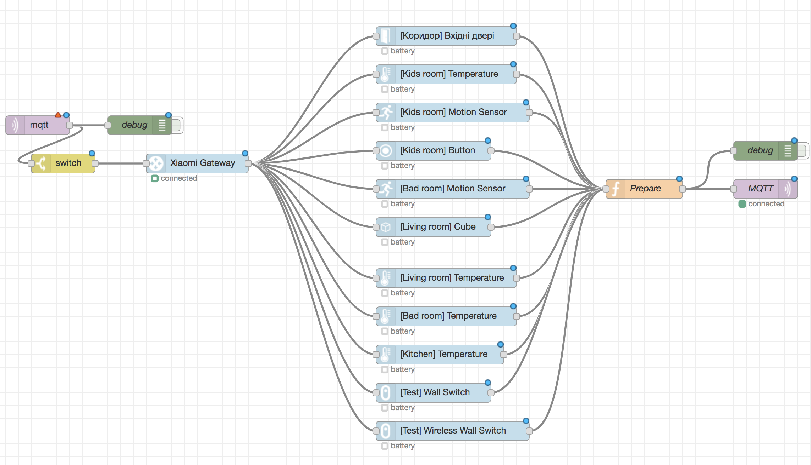

# node-red-contrib-xiaomi-smart-devices v2

This module contains the following nodes to provide easy integration of the Xiaomi devices into node-red.

The following devices are currently supported:

* Gateway
* Humidity & Temperature Sensor
* Human Body Sensor
* Magic Cube Controller
* Water Leak Sensor
* Window-Door Sensor
* Switch (Button)
* Wall Switch (one key, two keys, wired, wireless)
* The Xiaomi Smoke Detector (Beta)

# Installation
To install this module use Node-Red GUI installer or console command:

```
npm i node-red-contrib-xiaomi-smart-devices --save
```

# Example

